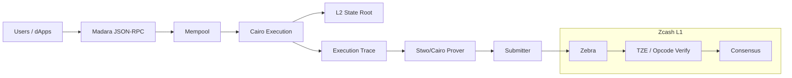

# Ztarknet 🛡️🐺

**Ztarknet 🛡️🐺** proposes a Starknet-style L2 that executes **Cairo** programs, proves the resulting state transitions with [**Circle STARKs**](https://eprint.iacr.org/2024/278) ([Stwo](https://github.com/starkware-libs/stwo-cairo)), and **settles** those transitions on **Zcash L1** by having full nodes verify the proof natively via a TZE verifier. It reuses an existing Starknet client (e.g., **Madara**) for sequencing/execution and a **Stwo/Cairo** prover for proofs. The L1 verification surface is a **single TZE type** defined by a draft ZIP.

**Why Zcash?** Zcash already offers strong base-layer privacy. Ztarknet explores **programmability and scale** via an L2—with validity proofs checked natively on Zcash using the TZE framework ([ZIP-222](https://zips.z.cash/zip-0222)) and the associated digest changes (ZIP-245/244).

## Repositories

* **Zebra (fork)** — Zcash consensus node in Rust, extended with the Circle‑STARK verifier and plumbing needed for PoC experiments.
  [https://github.com/Ztarknet/zebra](https://github.com/Ztarknet/zebra)

* **Madara (fork)** — Starknet client / sequencer (Rust). Used as the Ztarknet L2 execution layer: RPC, mempool, block building, state commitments.
  [https://github.com/Ztarknet/madara](https://github.com/Ztarknet/madara)

* **ztarknet (orchestration)** — Main repo for docs and infra. Contains Docker Compose and Kubernetes manifests to spin up local devnets/testnets: sequencer, prover, and Zcash node(s).
  [https://github.com/Ztarknet/ztarknet](https://github.com/Ztarknet/ztarknet)

* **zcash_script (fork)** — Script interpreter repo. Kept to support the **opcode fallback** path using the pure‑Rust interpreter (avoids C++ FFI).
  [https://github.com/Ztarknet/zcash_script](https://github.com/Ztarknet/zcash_script)

---

## One‑paragraph concept

1. Users send L2 transactions to a Starknet‑compatible sequencer (Madara).
2. The sequencer executes Cairo, updates the L2 state root, and emits execution traces.
3. A prover (Stwo/Cairo) produces a **Circle‑STARK** proof for the state transition.
4. A submitter publishes a Zcash transaction that includes the proof (via TZE or the opcode+v6 witness path).
5. Zcash nodes verify the proof during consensus and advance the on‑chain L2 anchor.

---

## Minimal architecture (PoC)

---

## How to get started

* **Run a devnet:** see the `ztarknet` repo for Compose/K8s recipes and step‑by‑step notes.
* **L1 experiments:** use the **Zebra fork** to test verification on Zcash test networks.
* **L2 experiments:** use the **Madara fork** to execute Cairo programs and produce state roots.
* **Opcode path:** only needed if we go with the Script opcode approach; see the **zcash_script** fork.

---

## Principles

* Keep changes minimal and auditable.
* Pin verifier versions and parameters; enforce strict size/runtime bounds.
* Be explicit about trade‑offs (data availability, fees, latency).

---

## Questions / contributions

Open an issue in the relevant repo with concrete context (branch, command, logs).
Discussions and design notes live in the `ztarknet` repo.
